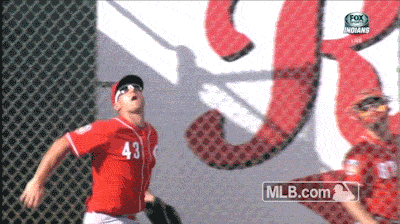
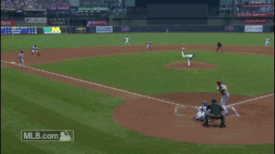
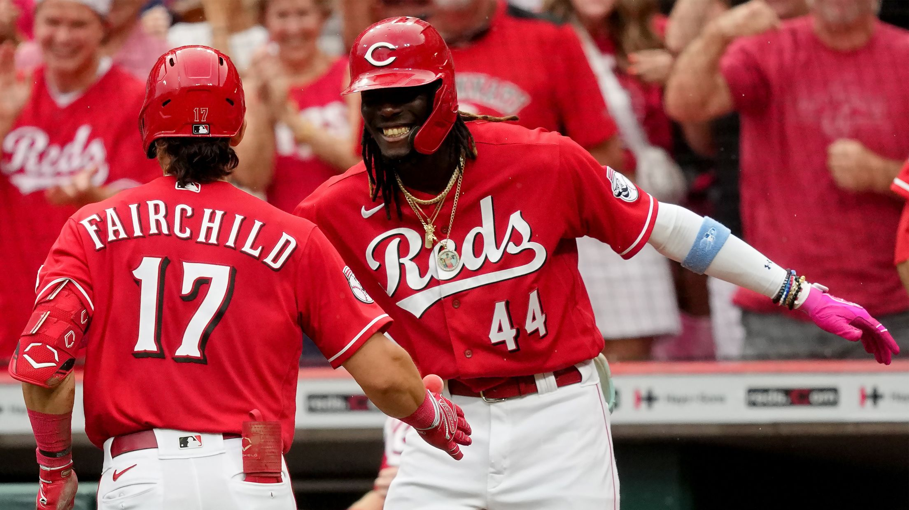

# Cincinnati-Reds
This is a Cincinnati Reds themed repository

## Introduction
The Cincinnati Reds are an American professional baseball team based in Cincinnati. They compete in Major League Baseball (MLB) as a member club of the National League (NL) Central division and were a charter member of the American Association in 1881 before joining the NL in 1890.
The Reds played in the NL West division from 1969 to 1993, before joining the Central division in 1994. For several years in the 1970s, they were considered the most dominant team in baseball, most notably winning the 1975 and 1976 World Series; the team was colloquially known as the "Big Red Machine" during this time, and it included Hall of Fame members Johnny Bench, Joe Morgan and Tony Pérez, as well as the controversial Pete Rose, the all-time hits leader.

### Best Cincinnati Reds Teams List according to MLB.com
1. 1975 reds
2. 1976 reds
3. 1940 reds
4. 1990 reds
5. 1973 reds

### Best Reds Players (unorderded list)
- Pete Rose
- Johnny Bench
- Joe Morgan
- Joey Votto
- Brandon Phillips

### Cincinnati Reds Website
<https://www.mlb.com/reds>

### Image Highlights







### Go Reds
``` python
r = "Go Reds!"
print r
```
`reds` `are` `back`

### Post Season (inline html)
<dl>
  <dt>Post Season</dt>
  <dd>The Reds are looking to improve on their .500 record from last year and make a run for the playoff this year.</dd>

### Youtube Highlights
[](http://www.youtube.com/watch?v=xSfaGeaK8oo)

